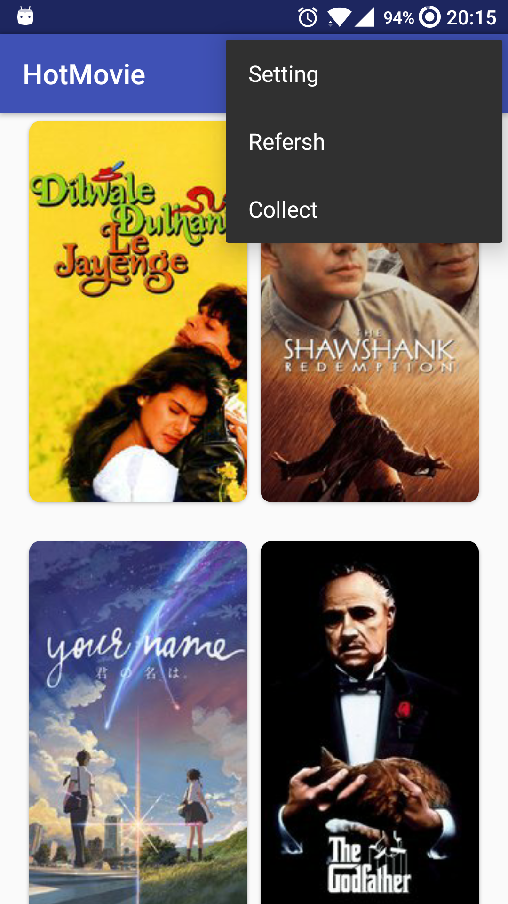
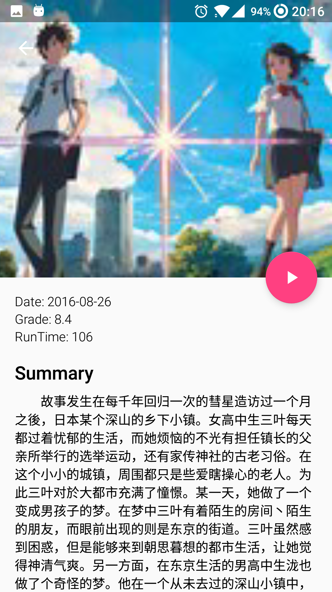

# HotMovie
一个展示当下热门电影和经典电影的Android APP。

## 屏幕截图
| 首页 | 通知 |
| ---- | ---- |
|  | |

| 详情页 | 留言 | 设置 |
| ---- | ---- | --- |
| | |  |

## 项目结构

- app
	- java
		- com.example.fourfish.hotmovie
			- adapter
			- api
			- data
			- Entry
			- sync
			- tool
				- DetailActivity
				- DetailFragment
				- MainActivity
				- MainFragment
				- SettingsActivity
				- UnScrollListView
  - res

## 功能
1. 使用ContetProvider存储数据，支持离线使用
2. 拥有平板布局。
3. 数据定期自动更新。有新内容，通过状态栏通知。
4. 自定义影片种类
5. 收藏影片

## 使用到的开源框架
1. picasso
2. butterKnife-compiler
3. retrofit2
4. sretho
